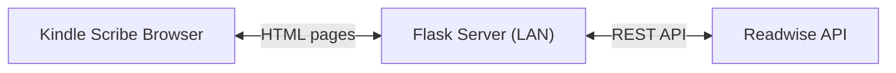

# Kindle Scribe Readwise Reader

## Architecture



The Flask server acts as a proxy: it fetches data from Readwise, renders clean HTML server-side, and serves it to the Kindle. The API token stays on the server -- the Kindle never touches the Readwise API directly.

## Tech Stack

- **Python 3 + Flask** -- server-side rendered HTML via Jinja2 templates
- **No client-side JavaScript** -- all interactions are full page loads (links and forms)
- **Minimal CSS** -- embedded in `<style>` tag in base template (no external stylesheet request)
- **python-dotenv** -- for loading the API token from a `.env` file
- **requests** -- for calling the Readwise API
- **beautifulsoup4** -- for stripping images/SVGs from article HTML (safe against malformed HTML)

## File Structure

```
app.py                 # Flask application (routes, API proxy, caching)
requirements.txt       # Flask, requests, python-dotenv, beautifulsoup4
.env.example           # Template: READWISE_TOKEN=your_token_here
.gitignore             # .env, __pycache__, .DS_Store
templates/
  base.html            # Minimal HTML skeleton, embedded CSS, font stack
  list.html            # Article list page
  read.html            # Article reader page
  error.html           # Friendly error page with retry link
README.md              # Setup and usage instructions (including token setup)
```

No `/setup` route. Token configuration is documented in the README: create a `.env` file, paste your token, done.

`app.secret_key` set from a `SECRET_KEY` env var (with a random fallback default) -- required for Flask's `flash()` session cookies used by the archive confirmation message. Documented in `.env.example`.

## Pages and Routes

### 1. Article List (`GET /`)

- Fetches documents from `GET /api/v3/list/` with `category=article` (excludes highlights/notes which have `parent_id` set)
- Default filter: `location=later` (the "read later" queue)
- Tab-style navigation: **Later** | **New** | **Archive** (large tap targets, full page links like `/?location=new`)
- Each article shows: **title** (large, tappable link), author, reading time, word count
- **Reading progress** shown as a thin CSS bar under each article (data from `reading_progress` field, zero overhead)
- No images anywhere on this page
- Pagination via Readwise's `pageCursor` (Next/Previous buttons at bottom)
- 20 articles per page (keeps payload small)

### 2. Article Reader (`GET /read/<id>`)

- Fetches single document via `GET /api/v3/list/?id=<id>&withHtmlContent=true`
- **Handles missing content**: if `html_content` is `None` or empty (article not yet parsed, or parsing failed), renders a "Content not available" message with a fallback link to `source_url` so the user can open the original page
- Renders the `html_content` field after sanitization when available
- **HTML sanitization via BeautifulSoup** (`html.parser`): strips ``, `<picture>`, `<figure>`, `<svg>`, `<video>`, `<audio>`, and `<iframe>` tags to save bandwidth and avoid broken rendering
- Font stack: `Georgia, "Times New Roman", serif` (Bookerly is a Kindle rendering engine font for book content and almost certainly not available to the experimental browser -- not worth pursuing)
- Large line-height (1.7) and readable font size (~18px) for e-ink
- Top bar: **Back to List** link + **Archive** button (large touch targets, min 48px tall)
- Simple `<article>` wrapper with max-width for comfortable reading

### 3. Archive Action (`POST /archive/<id>`)

- Calls `PATCH /api/v3/update/<id>` with `{"location": "archive"}`
- **Invalidates the article list cache** immediately so the archived article disappears on redirect
- Redirects back to the article list with a flash message "Article archived"
- Implemented as a `<form>` with a submit button (no JS needed)

## Kindle Scribe Optimizations

- **Viewport meta tag**: `<meta name="viewport" content="width=device-width, initial-scale=1">` -- the Scribe's 10.2" display at 1860x2480 likely reports a smaller viewport to the browser; this ensures the layout adapts
- **No JavaScript at all** -- every interaction is a link or form submission
- **No web fonts loaded** -- rely on device fonts only (Georgia/serif)
- **No images** in article list; stripped from article content server-side via BeautifulSoup
- **No SVGs** -- stripped from content, none used in UI
- **High contrast** -- black text on white, no grays for important elements
- **Large touch targets** -- all buttons/links minimum 48px height with generous padding
- **Embedded CSS** -- in `<style>` tag, no external stylesheet request
- **Small page payloads** -- 20 articles per page, content-only rendering

## Caching Strategy

Write-invalidated in-memory cache (no TTL):

- Article list responses are cached in a dict keyed by `(location, pageCursor)`
- Individual article HTML cached by document ID after first fetch
- **Any write action** (archive) **invalidates the entire list cache** immediately
- This avoids the stale-list problem (archiving then seeing the article still listed) while protecting the 20 req/min rate limit during normal read-only browsing
- A manual "Refresh" link on the list page can also force cache invalidation if needed

## Error Handling

Every route is wrapped in `try/except`:

- **API down / network error**: renders `error.html` with "Could not reach Readwise -- tap to retry" and a link back to the current page
- **Invalid token**: renders `error.html` with "Invalid API token -- check your .env file"
- **Rate limited (429)**: renders `error.html` with "Too many requests -- wait a moment and tap to retry", pulls wait time from `Retry-After` header if available
- **Unexpected errors**: renders `error.html` with a generic message, no stack traces exposed

On a Kindle browser, an unhandled 500 would render as a blank page or cryptic error, so this is critical.

## Self-Hosting

Run with `python app.py` which starts Flask on `0.0.0.0:5000`. Access from Kindle at `http://<your-machine-ip>:5000`. The README will include clear setup steps including how to find your Readwise access token and configure `.env`.